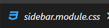
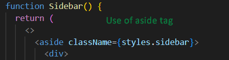
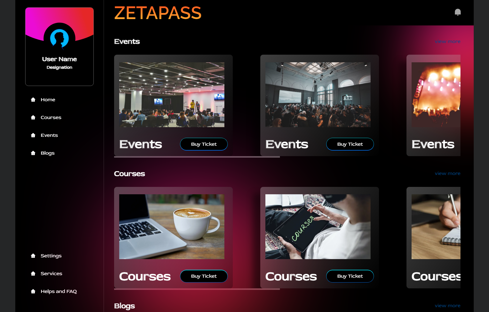

# Team Chirag and Khusbhu
- This site is currently optimized for desktop only (1440px)

This Particular Project is hosted here [site](https://zetapass-hackathon.netlify.app/)

## Here's what that make our project unique
- **It has a Readme file**: The README file is critical for ensuring that your project is easy to use and understand, and helps to communicate its value to others. It also helps to increase the visibility and credibility of your project by providing clear and concise documentation.
- **Use of Modular CSS**: We have used modular CSS to structure and organize our styles. Some key benefits of using approach are Improved maintainability, Increased scalability, Consistency and standardization.

- **Use of Semantic HTML**: Semantic HTML is an important best practice for web development, as it provides a clear and well-defined structure for your content, improves accessibility, search ranking, styling, and maintainability, and enhances the overall quality and usability of your website.

- **Use of react-router-dom**: We have used [`react-router-dom`](https://reactrouter.com/en/main) for routing purposes. It provides a set of components and functions that allow us to define and manage the different routes and navigation paths in our application. By using [`react-router-dom`](https://reactrouter.com/en/main) for routing purposes, we have been able to create a flexible and scalable navigation system for our React application, providing a superior user experience and improved maintainability.
- **Use Of Comments**: We have used comments in the code, but we have not overused them in order to avoid confusion. Comments are an important tool for documenting and explaining the code, but too many comments can actually make the code harder to read and understand.
- **Hosted the Site**: We have hosted the website so that you don't have to run it on your local machine to see it in action. We have made it more convenient, accessible, collaborative, and scalable.

